# Hands on: Real-time Chess
### with WebSockets and Socket.io

[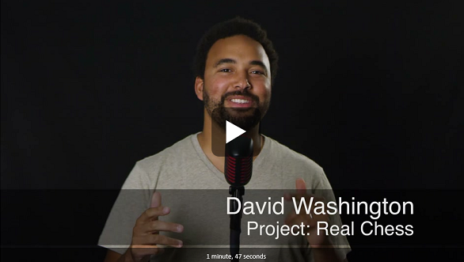](https://channel9.msdn.com/Shows/Lets-dev-this/LDT1605)

In this hands on lab, we'll make a multiplayer chess game that where your moves are shown on your opponent's screen in real-time. Instantly. Checkmate.

# Lab Overview
 
## Learning Objectives
After completing the exercises in this lab, you will be able to:
* Create a Node.js web app, run, and debug it locally
* Create a basic a Socket.io server
* Publish your server to Azure from GitHub

Estimated time to complete this lab: **60 minutes**

## Prerequisite software
In order to complete the lab, you need the following pre-requisites

* Windows 10, Mac OS 10 Yosemite, or Linux
* [Visual Studio Code](http://code.visualstudio.com)
* [Node.js](https://nodejs.org)


## Prerequisite online accounts
In order to complete the lab, you need the following prerequisite online accounts
* [Microsoft account](http://accounts.microsoft.com) – Needed to use Microsoft Azure
* [Microsoft Azure Subscription](http://azure.com) – A free trial is sufficient
* [GitHub](http://github.com) – Required to deploy code to Azure

## A note on using completed steps
This lab contains the code for each of the completed steps below. Feel free to look at or use the code from the steps if you get lost or need help. If you replace your code from one of the steps, or skip a few steps, you'll need to install the Node package dependncies for that step. This step is not required if the are following along with the below steps

 ````
  > npm install
 ````

# Exercise 1: Create a node app and run it locally
 
## Scenario
We will create a basic Node.js web app that serves up some HTML content using the Express framework and run it locally.

## Create your project folder

1. Open the **Node.js command prompt** from the task bar or by searching for it in Start.

    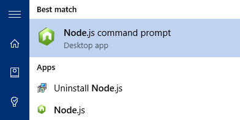

2. Make a new folder named **chess** that will contain our source code and navigate to it

 ````
  > mkdir chess
  > cd chess
 ````
 
3. After you create the folder, now you need to create the package metadata for your node app. This file will include all of the project decencies. 
 
 ````
  > npm init
 ````
 
4. This will walk through a tutorial, keep all the defaults by repeatedly hitting enter.

   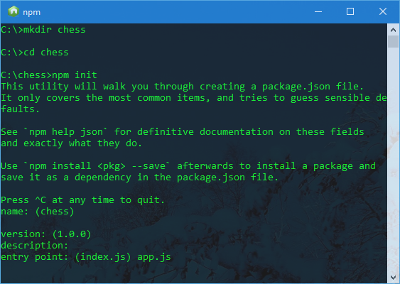

5. List the folders contents and open the package file

     ````
      > dir
      ````
6. Open the current folder in Visual Studio Code by typing **code .**
 
7. Observe your project metadata displayed in Visual Studio Code by clicking on the **project.json** file.

    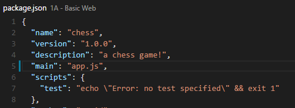

## Create a simple web server

1. Click on the new file button and create a new file named **index.js**

    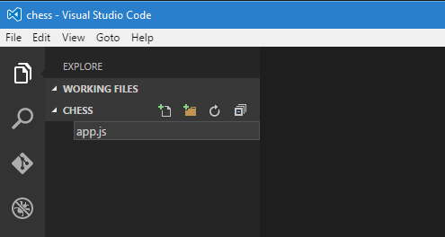

2. In your **index.js** file paste in the following code. This is the code for your web server.

    ````javascript
    var express = require('express');
    var app = express();
    app.use(express.static('public')); 
    var http = require('http').Server(app);
    var port = process.env.PORT || 3000;
    
    app.get('/', function(req, res) {
        res.sendFile(__dirname + '/public/default.html');
    });
    
    http.listen(port, function() {
        console.log('listening on *: ' + port);
    });
    ```` 

3. Create a new folder called **public** and create another file called **default.html** in the same folder and type hello world into it. Go ahead and save it.

    

4. Switch back to the Node.js command prompt and type **npm install express --save**. This will add the express web framework to your node app so you can host web content. 

    <sub>Note: The **--save** parameter adds a package dependency automatically for you in the **package.json** file.</sub>
    
    ```` 
    > npm install express --save
    ````
    
    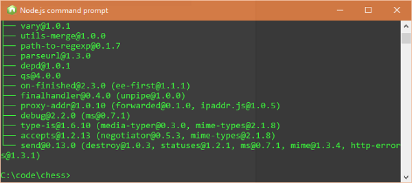
     
5. Switch back to Visual Studio Code, click the Debug button on the left and hit the play button to start your project. 

    

6. You can see in the Debug Console that the “listening on *: 3000” console message was printed out so we know our code is working. Let’s see if it’s hosting the page.

    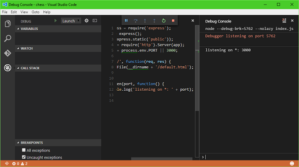

7. Open your browser and navigate to **http://localhost:3000** and you’ll see your webpage 

    

*You can find the completed code for this step in the **/1A - Basic Web** folder.*

## Add the chess game

### What we need
 1.	[Chessboard.js](http://www.chessboardjs.com/) – This is a full interactive touch ready chessboard that let’s you programmatically place chess pieces, respond to player movements through event callbacks, and customize piece theme. This is the UI and visual behavior.
 2.	[Chess.js](https://github.com/jhlywa/chess.js/) – This is the chess logic. It will know if something is a valid chess move and maintain the game logic and state. What’s cool is that it’s compatible with Chessboard.js by using a standard FEN notation for board layout and game moves.

### Get started
1. Download the **__LAB RESOURCES** folder from this lab repo and copy it's contents into your **/public/** folder.
    
    <sub>Note: The __LAB RESOURCES folder contains the chess libraries, images for the chess game, and Jquery. Even though we don't use JQuery for our game, the Chessboard.js library depends on it.</sub>

2. Add the chess markup to your **default.html** in your **/public/** file.

    ````html 
    <!doctype html>
    <html>
      <head>
        <title>Chess</title>
        <link rel="stylesheet" href="lib/chessboard-0.3.0.min.css">
        <link rel="stylesheet" href="/default.css" />
      </head>
      <body>
        <div id='gameBoard'></div>       
        <script src="lib/chess.min.js"></script> 
        <script src="lib/chessboard-0.3.0.min.js"></script> 
        <script src="lib/jquery-1.11.1.js"></script> 
        <script src="/default.js"></script>
      </body>
    </html>
    ````
     
3. Create a new file named **default.js** in your **/public/** folder and paste in the following source code.

    ````javascript
    var board;
    var game;

    window.onload = function () {
        initGame();
    };
    
    var initGame = function() {
       var cfg = {
           draggable: true,
           position: 'start',
           onDrop: handleMove,
       };
       
       board = new ChessBoard('gameBoard', cfg);
       game = new Chess();
    };

    var handleMove = function(source, target ) {
        var move = game.move({from: source, to: target});
        
        if (move === null)  return 'snapback';
    };
    ```` 
    
4. Create a new file named **default.css** in the **/public** folder. Copy the below styles to center the board on the page and give it a width.
   
    ````css
    body {
    	overflow-y: auto;
    	display: flex;
    	align-items: center;
            justify-content: center;
    } 
    
    #gameBoard {
        width: 400px;
    }

   ```` 
5. Finally, we need to go run the full game that we created. Click the play button to start debugging the Chess game. You’ll see that it’s running!

    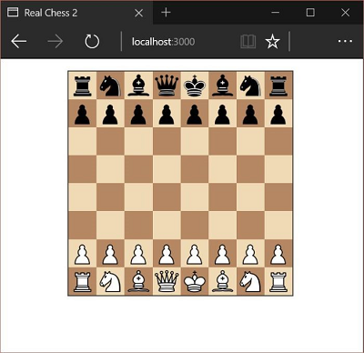

*You can find the completed code for this step in the **/1B - Chess Game** folder.*

# Exercise 2: Make it real-time with Socket.io

## Scenario
What’s going to make our chess game special is that it’s real-time and superfast to make, and respond to chess moves. WebSockets and the Socket.io JavaScript framework are the special sauce that is going to make this work.
Respond to a simple Socket.io message

## Respond to a simple Socket.io message

### What we need
* [Socket.io](http://socket.io) - A client and server Javascript framework for doing real-time stuff with WebSockets

### Get started
1. Open the ‘Node.js command prompt’ and type ‘npm install socket.io’ This adds the project dependencies to our project.
  
  ```` 
    > npm install socket.io --save
  ````
  
2. Add an additional reference in your **public/default.html** to include the Socket.io client-side library with the other script references.

    ````html 
    <script src="lib/socket.io-1.2.0.js"></script>
    ````
   
3. Update **/public/default.js** to send a message to the server when someone clicks on the page.
  
  ````javascript
   // setup my socket client
   var socket = io();
   
    window.onclick = function(e) {
        socket.emit('message', 'hello world!');
    }
  ```` 
  
4. Now update **/index.js** to respond to that message by outputting to the log.

    ````javascript
    // setup my socket server
    var io = require('socket.io')(http);
     
    io.on('connection', function(socket) {
        console.log('new connection');
    
        socket.on('message', function(msg) {
            console.log('Got message from client: ' + msg);     
        });
    });
    ```` 

Now when you run it, observe in the console that your message made it across when you click on the page! 

   

*You can find the completed code for this step in the **/2A - Simple Socket.io** folder.*

## Connect our game to Socket.io
In our basic Socket.io server above, we just sent a message to the client every time someone clicked the button in their browser. For the chess game, all we need to do is send the chess move data to the Socket.io server every time there’s a move and send it to the other player. We’re going to use the same socket.emit() function to send a message, and the socket.on() handlers to respond to them.

1. Update your **/public/default.js** client to send a move with socket.emit when they make a move on the chess board.

    ````javascript
    // called when a player makes a move on the board UI
    var handleMove = function(source, target) {
        var move = game.move({from: source, to: target});
        
        if (move === null)  return 'snapback';
        else socket.emit('move', move);
        
    }
    ```` 

2. On the server in **/index.js** replace our simple onmessage handler with a handler for chess move.

    ````javascript
    io.on('connection', function(socket) {
        console.log('new connection');
    
        // Called when the client calls socket.emit('move')
        socket.on('move', function(msg) {
           socket.broadcast.emit('move', msg); 
        });
    });
    ````

*You can find the completed code for this step in the **/2B - Connect Game to Socket.io** folder.*

## Handle moves you get from the server
Now that the server is broadcasting the move to the opponent all we need to do is handle that on the client to actually display the move. We just do that with another socket.on() callback, this time on the client. I think it’s super cool that Socket.io has the same programming model whether you’re on the client or server.

1. Update your **/public/default.js** client to handle a move with a socket.on handler.
    
    ````javascript
    // called when the server calls socket.broadcast('move')
    socket.on('move', function (msg) {
        game.move(msg);
        board.position(game.fen()); // fen is the board layout
    });
    ````

2. Now run your server and try out your game. When you make a move on when browser you should see it change on the other tab.

*You can find the completed code for this step in the **/2C - Handle moves from Server** folder.*

# Exercise 3: Publish it to Azure

## Scenario
It’s great we’ve got our game working on our local Express server but that’s not enough for me. I need to put it out there so I can start playing faster chess with my family. To do this, we need to publish it on the internets. It’s a Node app so there are a number of places I could publish it like a Heroku app or an AWS EC2 instance. I’m going to use Azure, since I like how it lets me deploy from GitHub.
Fork a project from GitHub

### What we need
* [Microsoft Azure account](https://azure.microsoft.com) - You can get a free account with a bunch of free hosting credits to spend, or if you're a Student or Startup you can get plenty of free hosting to go live.
* [GitHub account](http://github.com) - GitHub is a free source control and versioning system that's awesome and you should be using it.

### Get Started
1.	Go to http://github.com/dwcares/realtimeweb-hol and click the fork repository button. 

    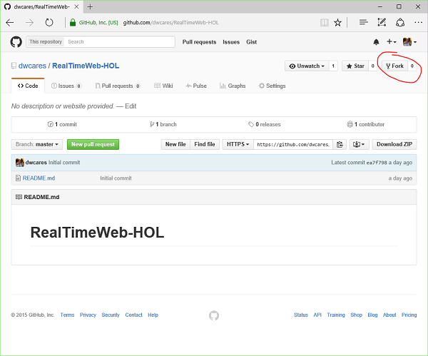
    <sub>Note: You need to be logged in with a GitHub account to complete this step.</sub>
 
2.	Forking the repository, makes a copy for you to play with. It essentially puts it in your sandbox to play with. We’re going to deploy your copy of the repository directly to Azure next.

## Deploy to Azure from GitHub

1.	Go to http://portal.azure.com and log in with your Microsoft Account

2.	When you are at the Azure Portal, click the new button then click the Web + Mobile category and Web App button.

    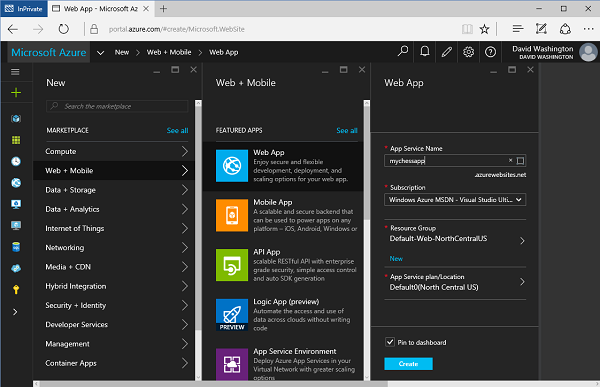

3.	Specify the details for your website. Note: The App Service Name corresponds to the beginning part of your url.

4.	Once the page is created, you need to deploy. Thankfully, Azure has a "Continuous Deployment" option.  This will take the code on github and automatically deploy it when there are any changes.

5.	Click settings in the header, and choose, Continuous Deployment from the list. Next, choose GitHub as the place to deploy from.

6.	You will need to authorize your account by logging in with your GitHub credentials. Follow the onscreen instructions.

7.	Choose the repository that we forked for this lab. 

    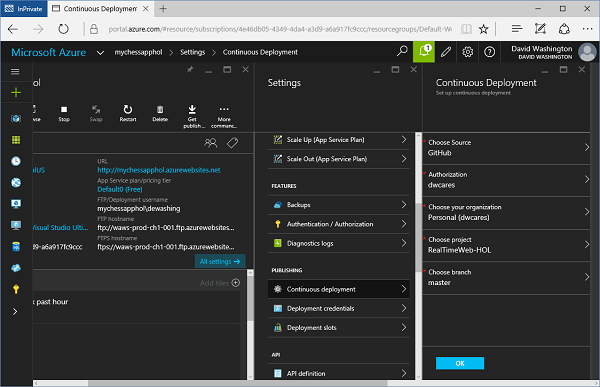
    
## Enable WebSockets on your Azure Server
WebSockets are not enabled by default on Azure WebSites, but you can easily enable them.

1. Click the **Application Settings** button on your website.

2. Scroll down to the **WebSockets** switch and enable it.

    

3. Click the Save button on the top.
    
# Complete
Go ahead and navigate to the url of your webpage in any browser! Congratulations! You've sucessfully built a real-time multiplayer chess game using Node.js, Socket.io hosted on Azure. 

## Quick recap
1. We built a simple JavaScript chess game with Chess.js and Chessboard.js
2. We built a simple Node.js and Express server that hosts the chess game JavaScript
3. We added Socket.io to our Node server to send and handle messages from the clients, first with a simple buton
4. We sent Socket.io messages to the server when the player completes her move, and broadcast it to the clients from the server.
5. We published the whole game online.

## Ideas for what's next
* Create a menu and a lobby to find opponents
* Wrap the UI in a better framework like Ionic
* Ship on mobile platforms using Cordova
* Consider building a 3D interface in Unity
* Use REDIS Cache for variables so the server can scale beyond one instance